# **Sensore di distanza con avvisi sonori e luminosi**
### Capitoli nel dettaglio
1. [Componenti Necessari](#1---componenti)
2. [Collegamenti](#2---collegamenti)
3. [Come scaricare il codice](#3---come-scaricare-il-codice)
4. [Basi di Arduino](#4---basi-di-arduino)
5. [Spieghiamo il Codice](#5---spieghiamo-il-codice)
6. [FAQs](#6---faqs)


## 1 - Componenti
***
Per iniziare questo piccolo progetto bisogna innanzitutto avere questi componenti di base, che di solito si trovano nei kit di Arduino o simili

1. **Microcontrollore Arduino**
2. **BreadBoard**
3. **Sensore di Distanza - HC-SR04**
4. **Un LED Rosso e uno Verde**
5. **Buzzer sonoro**
6. **Due Resistenze da 250 ohm**

## 2 - Collegamenti
***
Tramite il sito [Tinkercad](https://www.tinkercad.com/) ho realizzato questo schema circuitale per descrivere meglio i collegamenti
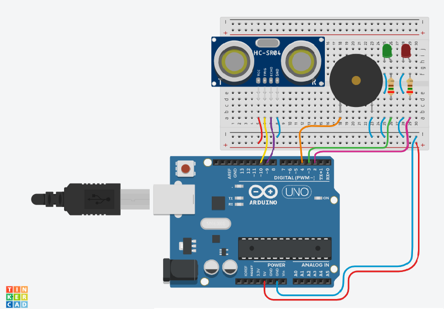

#### 1/4  **Attacco Alimentazioni**
Per prima cosa prendiamo la breadboard e iniziamo a collegare le alimentazioni
  Pin Arduino | Colore Cavo  | BreadBoard  |
| :-:   | :-: | :-: |
| 5 Volt (5V) | rosso | Positivo **+** |
| Ground (GND) | blu | Negativo **-** |

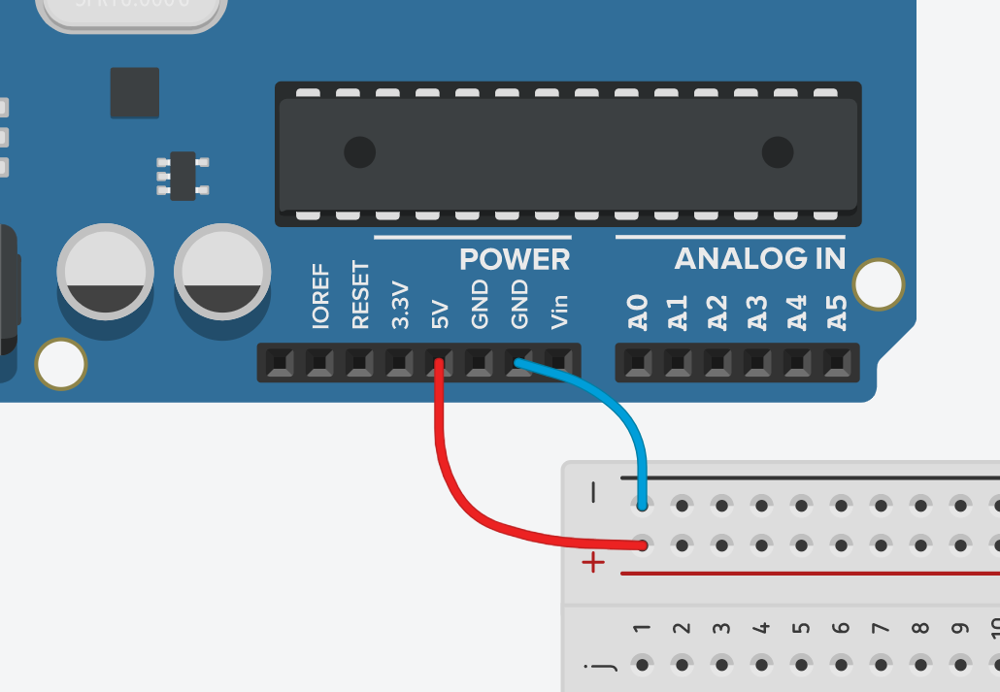

#### 2/4  **Collegamento HC-SR04**
Adesso colleghiamo il sensore di distanza all'arduino ai seguenti pin:
  HC-SR04 | Colore Cavo  | Collegamento  |
| :-:   | :-: | :-: |
| VCC | rosso | Positivo **+** (Breadbord) |
| GND | blu | Negativo **-** (Breadbord) |
| ECHO  | viola | Pin 9 (Arduino) |
| TRIG | giallo | Pin 10 (Arduino) |


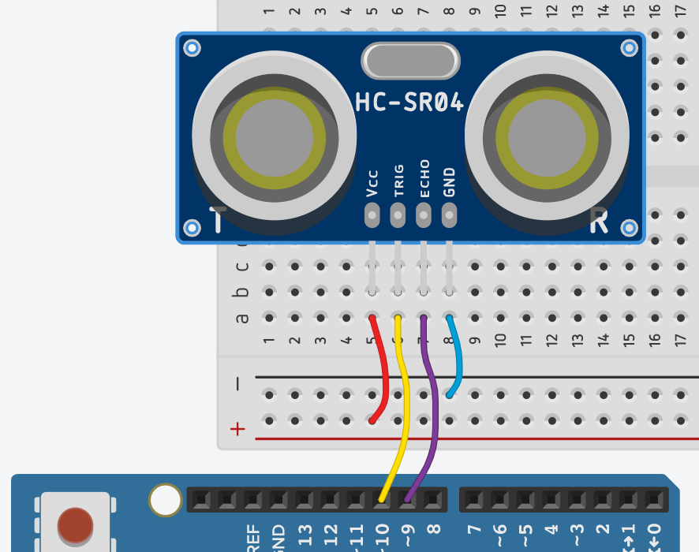


#### 3/4  **Colleghiamo i LED**
Adesso colleghiamo il sensore di distanza all'arduino ai seguenti pin:
  Led Rosso | Colore Cavo  | Collegamento  |
| :-:   | :-: | :-: |
| Anodo | rosa | Pin 2 (Arduino) |
| Catodo | blu | Negativo **-** (Breadbord) |


  Led Verde | Colore Cavo  | Collegamento  |
| :-:   | :-: | :-: |
| Anodo | verde | Pin 3 (Arduino) |
| Catodo | blu | Negativo **-** (Breadbord) |

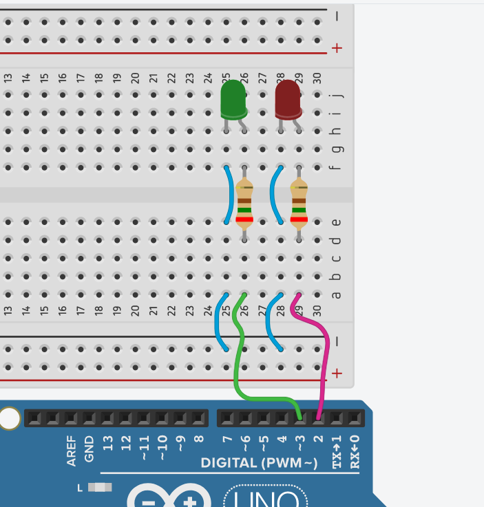

#### 4/4  **Aggiungiamo il buzzer**
Come ultimo step dei collegamenti, aggiungiamo il buzzer o cicalino (piezo) per emettere avvisi sonori con l'arduino
Un'estremità del buzzer andrà connessa al GND mentre l'altra estremità andrà collegata al **PIN 4 di arduino**


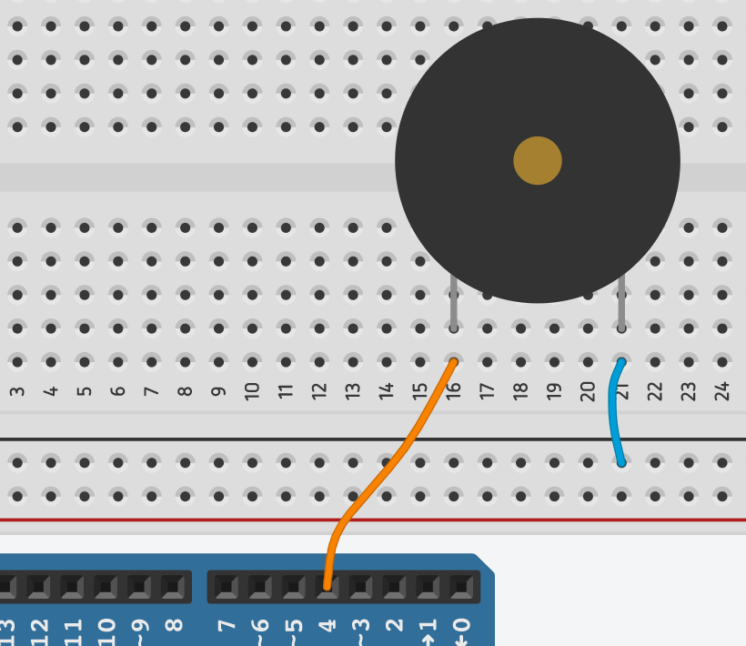


## 3 - Come scaricare il codice
***
Il codice può essere scaricato facilmente in due modi:
* Clonando la Repository
```
 git clone https://example.com
```

oppure

* Effettuando il Download dal Git Hub
 cliccando sul bottone **Code** poi su **"Downloasd ZIP"**

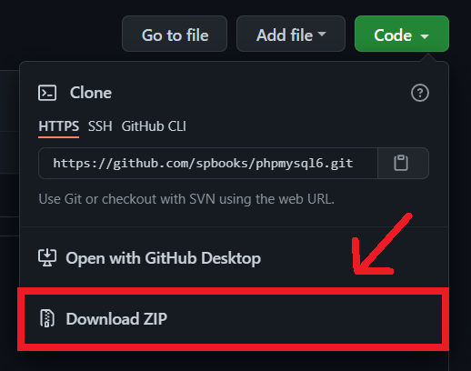


## 4 - Basi di Arduino
***
Ogni volta che andremo ad aprire il nostro [IDE Arduino*](#come-scaricare-ide-di-arduino) troveremo in ogni file una struttura così:
```
void setup(){

    //codice...

}
void loop(){

    //altro codice...
    
}
```
Quelle parole ```setup``` e ```loop```  precedute dalle due parentesi tonde sono delle funzioni che vengono create automaticamente quando apriamo un nuovo file, e queste sono molto importanti poichè dentro di esse andremo a scrivere il nostro codice.<br>

La parola ```void``` sta a significare che quella funzione non ha valori di ritorno, ovvero in parole semplici possiamo dire che quando eseguiremo la funzione non ci verrà restituito nessun numero o valore.

Le parentesi graffe delimitano blocco di codice relativo alla funzione, chiamato in questo caso Corpo della funzione
> void **Setup**()  --> Verrà eseguito una sola volta all'avvio di Arduino 

> void **Loop**()  --> Verrà eseguito una volta concluso il **Setup** e continuerà ad essere eseguito in loop fino allo spegnimento di Arduino


## 5 - Spieghiamo il Codice
***


### **#Define dei Pin**
All'inzio del codice andremo a scrivere tutte le define dei pin, ovvero assoceremo ad una parola un valore: *quando verrà trovata quella parola nella compilazione del codice, verrà sostituità dal valore che rappresenta* <br>

```
//SINTASSI
//#define   nomeParola  Valore
#define ledRosso  2
#define ledVerde  3 
#define buzzer  4


```
> Quando diamo un valore con la **#define** ,  questo non potrà essere cambiato, al contrario di una variabile

> Una **Variabile** possiamo immaginarla come un contenitore che racchiude un valore, che sia un numero, una stringa, un carattere... Come dice il nome, è un qualcosa che può cambiare e variare il suo valore durante l'esecuzione del programma

### **Dichiarazioni Variabili**
Adesso invece andremo a dichiarare le variabili del nostro Sketch Arduino (File di Codice) <br>

```
//SINTASSI
//tipoVariabile  nomeVariabile = Valore ;

int pinTrigger =   10;
int  pinEcho = 9;

int distanza;

```
> nel caso dei pin Trigger e Echo (quelli del sensore di distanza) potevamo anche usare delle **#define** solo che alcuni programmatori preferiscono dichiarare i pin con delle variabili di tipo intero per poter essere in grado di cambiare il loro valore durante l'esecuzione del codice

### **Il  Setup**
Nella parte di Setup del codice sono andato ad inizializzare tutti i Pin, in pratica stiamo dicendo ad Arduino quali pin useremo e se questi serviranno in INPUT o in OUTPUT.<br>
Come ultima riga del setup **Serial.begin()** ho inizializzato la Seriale e ho passato come parametro la velocità di Baud
```
void setup(){
    pinMode(pinTrigger, OUTPUT);
    pinMode(pinEcho, INPUT);
  
    pinMode(ledVerde, OUTPUT); 
    pinMode(ledRosso, OUTPUT); 

    Serial.begin(9600);
}

```
> inizializzare la **Seriale** vuol dire che stiamo comunicando ad arduino di utilizzare la *Comunicazione Seriale*, ovvero tramite la porta USB potremmo ricevere o inviare comandi o anche semplici messaggi


### **Funzione CalcolaDistanza()**

```
void loop(){

    int distanza = CalcolaDistanza(pinEcho, pinTrigger);
    
    .....
    .....
    .....
}
```

Come prima riga di codice ho creato la variabile distanza, di tipo intero, in cui andrò a mettere il risultato della funzione **CalcolaDistanza()**
```
//FUNZIONE CALCOLA DISTANZA

int CalcolaDistanza(int pinEcho, int pinTrigger){
  // imposta l'uscita del trigger LOW
  digitalWrite(pinTrigger, LOW);
  
  // imposta l'uscita del trigger HIGH per 10 microsecondi
  digitalWrite(pinTrigger, HIGH);
  delayMicroseconds(10);
  digitalWrite(pinTrigger, LOW);
  
  // calcolo del tempo attraverso il pin di echo
  long durata = pulseIn(pinEcho, HIGH);
  
  if( durata > 38000 ){
    Serial.println("Fuori portata");// dopo 38ms è fuori dalla portata del sensore
    return -1;
  }else{
    return (durata/58.31);
  }
}
```
> Il sensore Ultrasuoni HC-SR04 invierà un segnale alto dal pin Trigger per 10 microsecondi e il pin Echo attenderà questo segnale. <br>
N.B. il segnale ultrasuoni inviato dal pin Trigger rimbalzerà sul primo oggetto davanti al sensore e tornerà indietro nel pin Echo<br>
La distanza verrà calcolata a seconda di quanto tempo impiegherà il segnale Trigger a tornare in Echo


### **Void Loop()**
Nella parte del loop andremo a scrivere il codice principale che girerà in loop sul nostro microcontrollore.<br>
```

void loop(){

  int distanza = CalcolaDistanza(pinEcho, pinTrigger);
  PrintDistanza(distanza);

  //CONTROLLO DELLA DISTANZA
  if(distanza < 20)
  { 
    //se minore di 20 cm
      tone(buzzer,600,100);
      digitalWrite(ledRosso, HIGH); //accendi led rosso
      digitalWrite(ledVerde, LOW); //spegni led verde
      delay(100);
   
   }
   else if (distanza >=20 && distanza< 39)
   {
      //se compreso tra 20 e 39 cm
        tone(buzzer,500,200);
        digitalWrite(ledRosso, HIGH); //accendi led rosso
        digitalWrite(ledVerde, LOW); //spegni led verde
        delay(200);

      
    }
    else if (distanza >=40 && distanza<= 60)
    {
      //se compreso tra 40 e 60
        tone(buzzer,400,300);
        digitalWrite(ledRosso, HIGH); //accendi led rosso
        digitalWrite(ledVerde, LOW); //spegni led verde
        delay(300);

    }
    else
    {
      //se nessuna delle tre precedenti condizioni è vera
      // quindi se la distanza è maggiore di 60
        digitalWrite(ledVerde, HIGH); //accendi led verde 
    }
   
    
    digitalWrite(ledRosso, LOW); //spegni led rosso
    delay(100);
}
```
Come si vede qui sopra, sono presenti una serie di condizioni (IF) che a seconda della loro veriticità stabiliscono se far eseguire o meno un blocco di codice.
In questo caso, man mano che la distanza diminuisce diminuisce il **Delay** (Tempo di riposo) e quindi il codice viene eseguito più rapidamente così da far capire all'utente di essersi avvicinato troppo ad un ostacolo.
> La Funzione [tone()](https://www.arduino.cc/reference/en/language/functions/advanced-io/tone/) serve per far suonare il buzzer.<br>
> Richiede tre parametri:<br>
> - pin buzzer
> - frequenza suono (in Hertz)
> - durata
> <br><br>
> esempio:<br> ```tone(4, 300, 1000)<br>```
> <br>*suona a 300Hz il pin 4 per 1 secondo (1000ms)*


***
## 6 - FAQs

Lista delle possibili domande e perplessità
***
* #### __Come creare un file esterno per le nostre Funzioni__
1. Basta cliccare sulla freccettina in alto a destra e successivamente sulla dicitura **nuova scheda**

2. Dare il nome al nuovo file

3. Cliccare su **OK**
***

***
* #### __Come Scaricare IDE di Arduino__
1. Potete scaricare  dal sito https://www.arduino.cc/  l'**IDE Arduino** per scrivere codice e caricarlo sul vostro microcontrollore
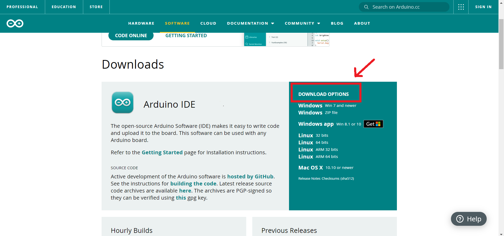
***
***
* #### __Usare il Monitor Seriale__
1. Cliccate in alto a destra sull'icona della lente di ingrandimento
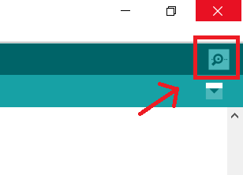
2. Dopo aver fatto ciò vi si aprirà il **Monitor Seriale**
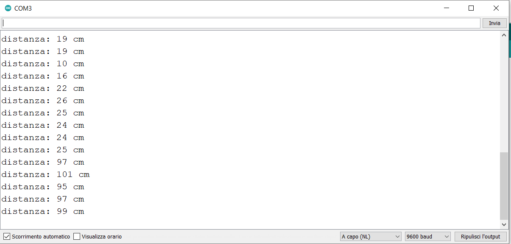
e vedrete tutti i messaggi che sta stampando Arduino in Seriale tramite *USB*

>p.s. Per far stampare messaggi in seriale usare **Serial.print(**"Ciao sono un messaggio"**)**
***

***
* #### __Caricare lo Sketch su Arduino__
1. Una volta ultimata la scrittura del codice cliccare la freccia in alto a sinistra
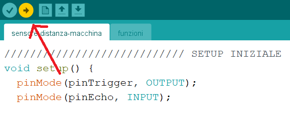
2. Dopo aver fatto ciò verrà compilato e caricato il codice su Arduino
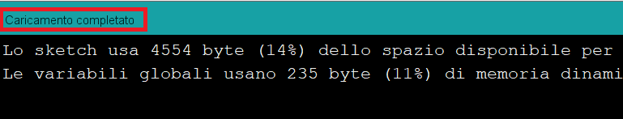
e vedrete tutti i messaggi che sta stampando Arduino in Seriale tramite *USB*

>p.s. Per far stampare messaggi in seriale usare **Serial.print(**"Ciao sono un messaggio"**)**
***


***
* #### __Cosa fare se non trova la porta COM__
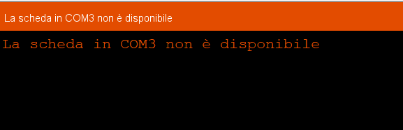
1. Verifica che sia presente e selezionata la porta COM di Arduino
  <br> *Strumenti > Porta > --COM ARDUINO---*
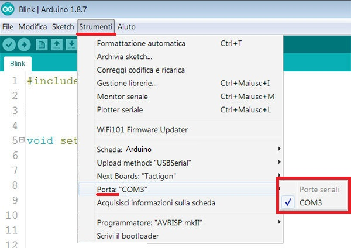
2. Se sono presenti più porte COM, allora appuntati tutti i numeri delle porte e scollega l'arduino.
<br> Adesso controlla quale numero di COM non è più collegato e così scoprirai qual è la porta giusta di Arduino
***


 


